# Deep Reinforcement Learning & Computer Vision for Autonomous Vehicle Control in ROS

An end-to-end autonomous vehicle control framework developed in **ROS (Robot Operating System)** and **Gazebo**. This project addresses the core challenge of **lane keeping** and **obstacle/crash avoidance** using three distinct machine learning paradigms:
1. **Discrete Reinforcement Learning**: Q-Learning with Tile Coding state space discretization.
2. **Continuous Deep Reinforcement Learning**: Deep Deterministic Policy Gradient (DDPG) with Actor-Critic architectures for joint continuous steering and velocity control.
3. **Supervised Computer Vision**: End-to-End Convolutional Neural Network (CNN) steering angle regression directly from monocular front-facing camera feeds.

---

## Technical Overview & System Architecture

Controlling an autonomous vehicle in complex road environments requires transforming high-dimensional sensor data (LiDAR range scans and camera feeds) into real-time steering and velocity commands.

```
                                  +---------------------------------------+
                                  |         ROS Gazebo Environment        |
                                  |    (Vehicle Kinematics + World)       |
                                  +-------------------+-------------------+
                                                      |
                  +-----------------------------------+-----------------------------------+
                  |                                   |                                   |
         [2D LiDAR Laser Scans]              [2D LiDAR Laser Scans]              [Monocular Front Camera]
          (180° Range Sectors)                (31 Continuous Inputs)                (200x200 Gray Frames)
                  |                                   |                                   |
                  v                                   v                                   v
      +-----------------------+           +-----------------------+           +-----------------------+
      |      Q-Learning       |           |     DDPG Algorithm    |           |    CNN Architecture   |
      | (Tile-Coded State)    |           |    (Actor-Critic RL)  |           | (Supervised Learning) |
      +-----------+-----------+           +-----------+-----------+           +-----------+-----------+
                  |                                   |                                   |
                  +-----------------------------------+-----------------------------------+
                                                      |
                                                      v
                                        [Steering & Speed Commands]
                                                      |
                                                      v
                                      +-------------------------------+
                                      |   Ackermann Kinematic Model   |
                                      +-------------------------------+
```

---

## Vehicle Kinematics & Simulation Environment

### 1. Ackermann Steering Kinematics Model
To simulate realistic vehicle mechanics, the simulated vehicle follows the **Ackermann Steering Model**, ensuring the inner front wheel turns at a steeper angle than the outer front wheel during cornering to prevent tire slippage:

$$\tan(\phi_{\text{inner}}) = \frac{H}{R - \frac{W}{2}}, \quad \tan(\phi_{\text{outer}}) = \frac{H}{R + \frac{W}{2}}$$

Where:
- $H$: Distance between front and rear axles (wheelbase).
- $W$: Track width (distance between left and right wheels).
- $R$: Turning radius measured from the vehicle's rear axle midpoint.
- $\phi_{\text{inner}}, \phi_{\text{outer}}$: Inner and outer front wheel steering angles.

The differential speed of the rear drive wheels is calculated as:
$$\text{Speed}_{\text{inner}} = v \left(1 - \frac{W}{2R}\right), \quad \text{Speed}_{\text{outer}} = v \left(1 + \frac{W}{2R}\right)$$

---

### 2. ROS Node & Sensor Configuration
The system communicates via **ROS Topics** connected to Gazebo plugins:
- **`catvehicle/front_laser_points` (`sensor_msgs/LaserScan`)**: 180-degree forward LiDAR scan returning range measurements up to 30 meters.
- **`catvehicle/front_camera/image_raw` (`sensor_msgs/Image`)**: Bumper-mounted front camera publishing visual frames.
- **`catvehicle/cmd_vel` (`geometry_msgs/Twist`)**: Motor velocity ($v$) and steering angle rate ($\omega$) command publisher.

---

### 3. Simulation Tracks
Two custom Gazebo track environments were constructed:
- **Training Track**: Features varying turn radiuses and straight tracks designed to encourage exploration and state-action coverage.
- **Testing Track**: An unseen, challenging track with S-curves and sharp turns to evaluate model generalization.

| Training Track Environment | Testing Track Environment |
| :---: | :---: |
| 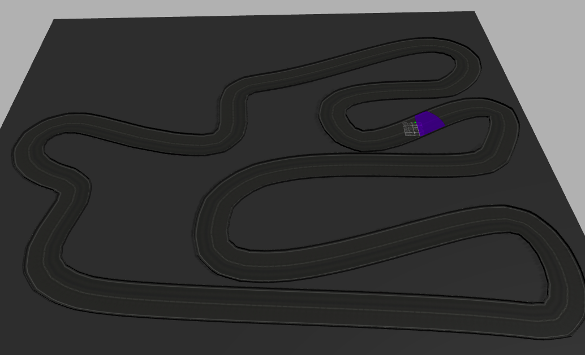 | 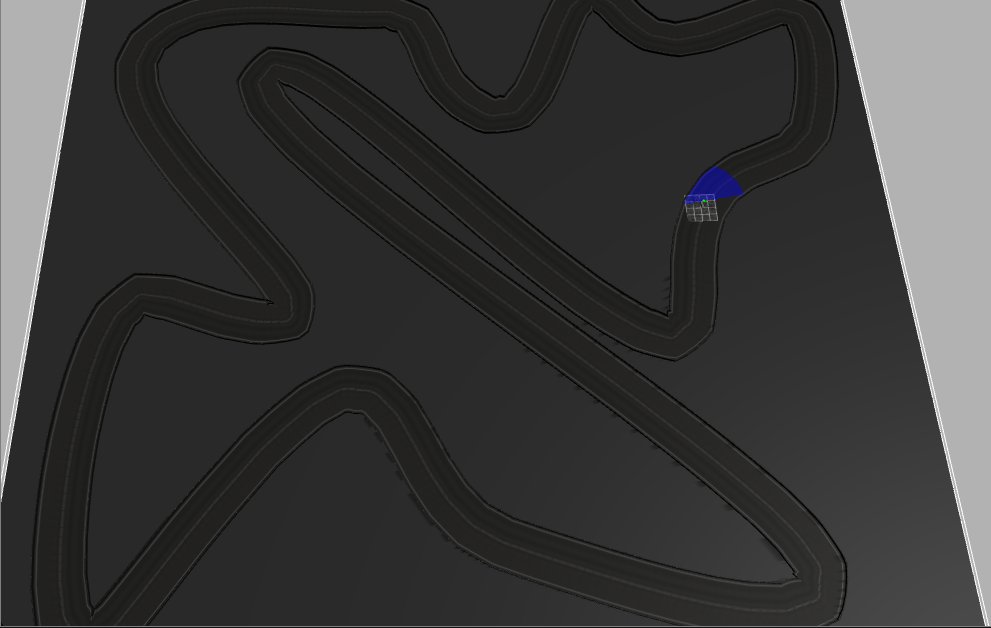 |

---

## Control Strategies & Algorithms

### 1. Discrete Reinforcement Learning: Q-Learning

Q-Learning optimizes an action-value function $Q(s, a)$ representing the expected cumulative discounted reward of taking action $a$ in state $s$:

$$Q(s, a) \leftarrow Q(s, a) + \alpha \left[ R_{t+1} + \gamma \max_{a'} Q(s_{t+1}, a') - Q(s, a) \right]$$

#### State Space & Tile Coding
To handle continuous 180° laser scan data in tabular Q-learning, the 180 range readings are aggregated into **5 directional sectors** (Far-Left, Left, Center, Right, Far-Right). Each sector range reading is discretized using **Tile Coding** into discrete distance buckets ($5\text{m}, 15\text{m}, 25\text{m}$), yielding a total state space of $3^5 = 243$ states.

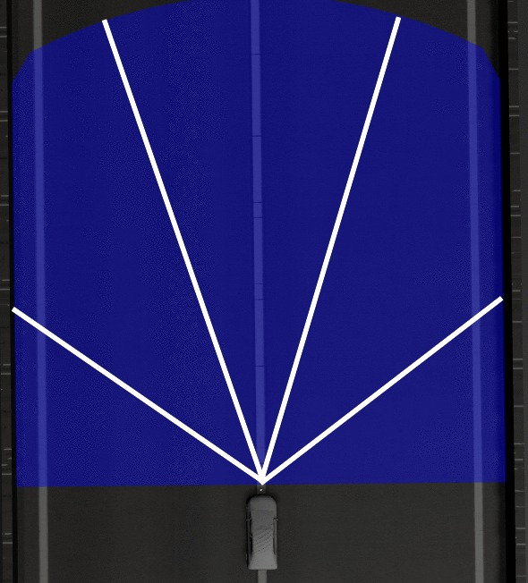

#### Action Space & Reward Function
- **Actions**: Discretized steering angles $\theta \in \{-0.2, -0.1, 0.0, 0.1, 0.2\}\text{ rad/s}$ combined with velocity increments.
- **Reward Function**:
  $$\text{Reward} = R_{\text{distance}} - P_{\text{obstacle}} - P_{\text{steering\_change}}$$
  - $R_{\text{distance}}$: Positive reward for maintaining maximum distance from obstacles/walls.
  - $P_{\text{obstacle}}$: Heavy penalty ($\le -100$) if any laser reading drops below critical safety threshold ($1.5\text{m}$).
  - $P_{\text{steering\_change}}$: Penalty for rapid steering alternations to promote trajectory smoothness.

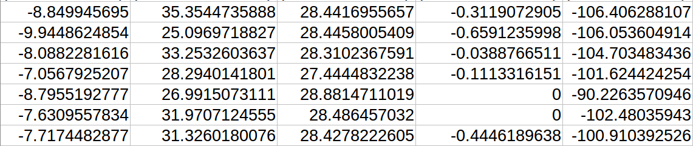

#### Q-Learning Hyperparameters
| Hyperparameter | Value | Description |
| :--- | :--- | :--- |
| **Learning Rate ($\alpha$)** | $0.05 - 0.15$ | Step size for value updates |
| **Discount Factor ($\gamma$)** | $0.3 - 0.9$ | Trade-off between immediate and future rewards |
| **Exploration ($\epsilon$)** | $0.01 - 0.10$ | $\epsilon$-greedy policy selection probability |
| **State Space Size** | $243$ | Tile coded states ($3^5$) |
| **Action Space Size** | $5$ | Discrete steering actions |

---

### 2. Continuous Deep Reinforcement Learning: DDPG

Deep Deterministic Policy Gradient (DDPG) is an off-policy Actor-Critic algorithm designed for continuous state and action spaces.

```
                     +---------------------------------------+
                     |           Current State (s)           |
                     +-------------------+-------------------+
                                         |
                       +-----------------+-----------------+
                       |                                   |
                       v                                   v
             +------------------+                +------------------+
             |   Actor Network  |                |  Critic Network  |
             |   mu(s | theta)  |                |   Q(s, a | phi)  |
             +--------+---------+                +--------+---------+
                      |                                   ^
                      v                                   |
              Action a = mu(s) + Noise -------------------+
                      |
                      v
             +------------------+
             |    Environment   |
             +------------------+
```

#### Actor-Critic Network Architecture
- **Actor Network $\mu(s | \theta^\mu)$**:
  - Input: Continuous state vector $s \in \mathbb{R}^{31}$ (27 continuous laser range beams + 4 wheel contact sensors).
  - Hidden Layer 1: $300$ units, ReLU activation.
  - Hidden Layer 2: $600$ units, ReLU activation.
  - Output Layer: $1$ continuous output unit with Tanh activation scaled to steering range $[-30^\circ, +30^\circ]$.
- **Critic Network $Q(s, a | \theta^Q)$**:
  - State Stream: Input $s \in \mathbb{R}^{31} \rightarrow$ Dense $300$ (ReLU) $\rightarrow$ Dense $600$ (Linear).
  - Action Stream: Input $a \in \mathbb{R}^1 \rightarrow$ Dense $600$ (Linear).
  - Fusion: Element-wise addition of state and action features $\rightarrow$ Dense $600$ (ReLU) $\rightarrow$ Linear output $Q(s, a)$.

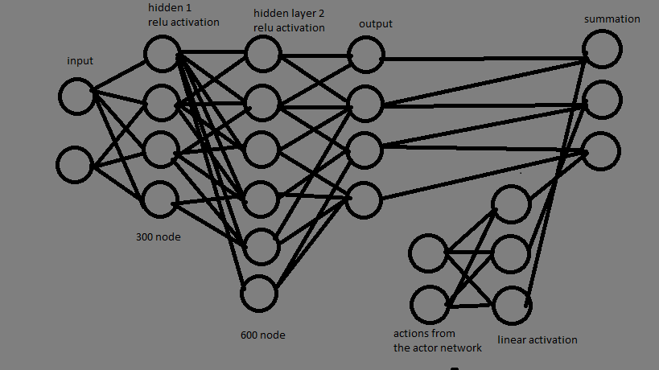

#### Mathematical Update Rules
1. **Critic Loss (MSE)**:
   $$L(\theta^Q) = \frac{1}{N} \sum_{i} \left( y_i - Q(s_i, a_i | \theta^Q) \right)^2$$
   $$y_i = r_i + \gamma Q'\left( s_{i+1}, \mu'(s_{i+1} | \theta^{\mu'}) \middle| \theta^{Q'} \right)$$

2. **Actor Policy Gradient**:
   $$\nabla_{\theta^\mu} J \approx \frac{1}{N} \sum_{i} \left. \nabla_a Q(s, a | \theta^Q) \right|_{s=s_i, a=\mu(s_i)} \left. \nabla_{\theta^\mu} \mu(s | \theta^\mu) \right|_{s=s_i}$$

3. **Soft Target Updates**:
   $$\theta^{Q'} \leftarrow \tau \theta^Q + (1 - \tau) \theta^{Q'}, \quad \theta^{\mu'} \leftarrow \tau \theta^\mu + (1 - \tau) \theta^{\mu'} \quad (\tau = 0.001)$$

4. **Exploration Noise (Ornstein-Uhlenbeck Process)**:
   $$dx_t = \theta (\mu - x_t) dt + \sigma dW_t$$

#### DDPG Hyperparameters
| Hyperparameter | Value | Description |
| :--- | :--- | :--- |
| **Replay Buffer Size** | $100,000$ | Experience replay capacity |
| **Mini-batch Size** | $32$ | Gradient update batch size |
| **Discount Factor ($\gamma$)** | $0.99$ | Discount factor for future rewards |
| **Soft Update Rate ($\tau$)** | $0.001$ | Target network polyak averaging rate |
| **Actor Learning Rate** | $1 \times 10^{-4}$ | Adam optimizer learning rate for Actor |
| **Critic Learning Rate** | $1 \times 10^{-3}$ | Adam optimizer learning rate for Critic |
| **Exploration Steps** | $100,000$ | Decay steps for OU noise |

---

### 3. Supervised Deep Learning: Convolutional Neural Network (CNN)

An end-to-end vision-based system that maps raw monocular front camera images directly to steering angles.

#### Camera Preprocessing & Layer Specifications
- **Input**: Front camera video frame resized and grayscaled to $200 \times 200 \times 1$.

| ROS Gazebo Bumper Camera Feed | CNN Architecture |
| :---: | :---: |
| 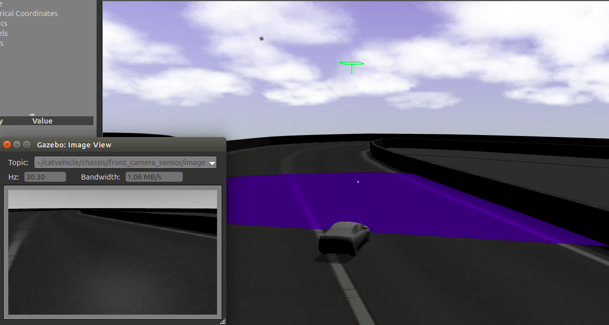 | 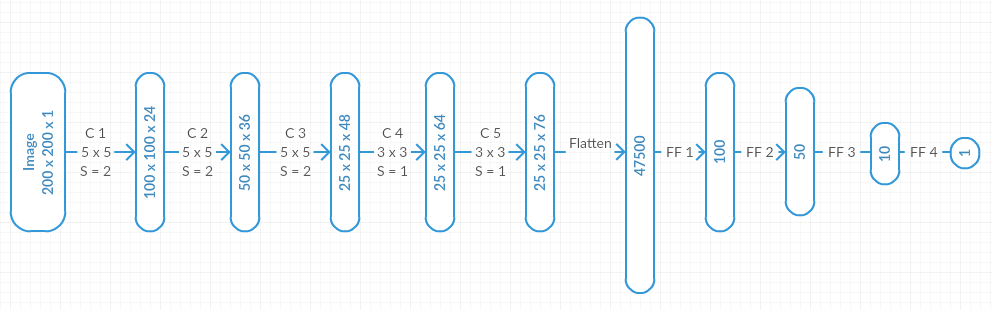 |

- **CNN Layer Pipeline**:
  1. **Conv Layer 1**: $24$ filters ($5\times5$), stride $2\times2$, ReLU. Output: $100 \times 100 \times 24$.
  2. **Conv Layer 2**: $36$ filters ($5\times5$), stride $2\times2$, ReLU. Output: $50 \times 50 \times 36$.
  3. **Conv Layer 3**: $48$ filters ($5\times5$), stride $2\times2$, ReLU. Output: $25 \times 25 \times 48$.
  4. **Conv Layer 4**: $64$ filters ($3\times3$), stride $1\times1$, ReLU. Output: $25 \times 25 \times 64$.
  5. **Conv Layer 5**: $76$ filters ($3\times3$), stride $1\times1$, ReLU. Output: $25 \times 25 \times 76$.
  6. **Flatten Layer**: Flattens feature maps to $47,500$ units.
  7. **Dense Layer 6**: $100$ hidden units, ReLU.
  8. **Dense Layer 7**: $50$ hidden units, ReLU.
  9. **Dense Layer 8**: $10$ hidden units, ReLU.
  10. **Output Layer 9**: $1$ linear output unit predicting continuous steering angle $\hat{y}$.

#### Dataset Balancing & Informed Action Synthesis
- **Straight-Line Bias Problem**: Most collected driving frames correspond to $0^\circ$ straight driving, creating severe prediction bias toward zero steering.
- **Histogram Balancing**: Sub-sampled $0^\circ \pm 10^\circ$ frames to equalize the training distribution across sharp turn angles.
- **Informed Action Recovery**: Generated recovery trajectory samples near track borders to train the model to recover autonomously when nearing boundaries.

| Unbalanced Dataset Histogram | Balanced Dataset Histogram |
| :---: | :---: |
| 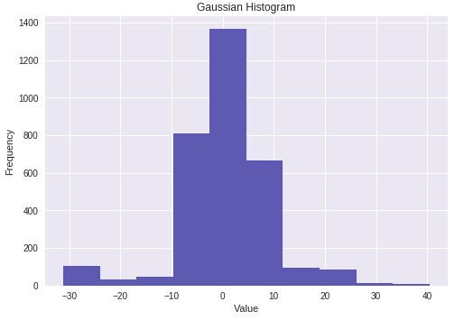 | 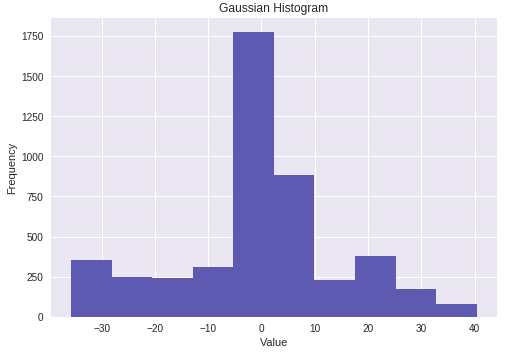 |

---

## Experimental Results & Performance Analysis

All algorithms were trained on the **Training Track** and evaluated across 20+ completed test laps on the unseen **Testing Track**.

### 1. Centerline Track Deviation Comparison
Track centerline deviation evaluates the percentage of lap distance where the vehicle strays from the center lane boundary.

| Model / Strategy | Performance Characteristic | Track Centerline Deviation Plot |
| :--- | :--- | :---: |
| **Discrete Q-Learning** | Discretized state/action space causes lateral oscillation ($57.87\%$ deviation). | 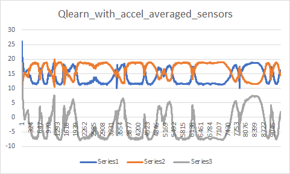 |
| **DDPG (Steering Only)** | Continuous control produces precise centerline tracking (**2.59%** deviation). | 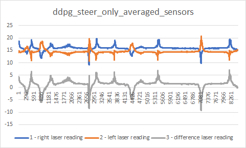 |
| **DDPG (Steering + Accel)** | Dynamic velocity increases speed into turns, slightly increasing deviation ($7.00\%$). | 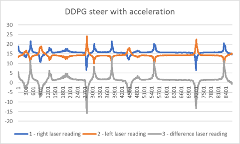 |
| **CNN (Vision Supervised)** | End-to-end vision provides smooth tracking with minor wide turns ($4.00\%$ deviation). | 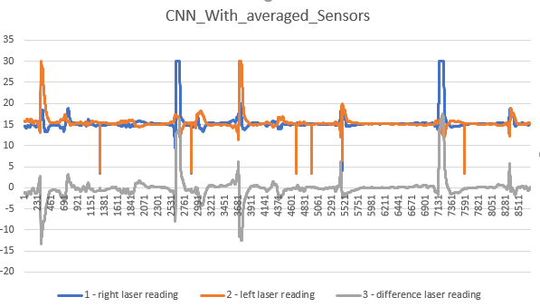 |

---

### 2. Steering Smoothness & Comfort Metrics
Steering angle change rate ($\Delta \theta / \text{sec}$) measures riding comfort and mechanical steering fatigue.

| Steering Change Rate Distribution | Steering Angle over Time |
| :---: | :---: |
| 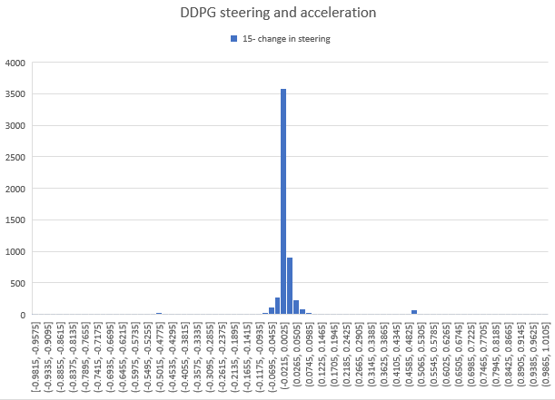 | 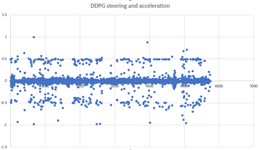 |

---

### 3. Quantitative Evaluation Summary

| Evaluation Metric | Q-Learning (Discrete RL) | DDPG Steering Only (Continuous RL) | DDPG Steering + Accel (Continuous RL) | CNN (Vision Supervised) |
| :--- | :---: | :---: | :---: | :---: |
| **Training Time** | 6.0 Hours | 3.0 Hours | 9.0 Hours | **0.3 Hours (20 mins)** |
| **Completed Laps** | >20 Laps | >20 Laps | >20 Laps | >20 Laps |
| **Mean Lap Time** | 375.48 sec | 340.30 sec | **224.01 sec** | 347.00 sec |
| **Steering Change Rate ($\Delta \theta / \Delta t$)** | 32.60°/sec | 6.79°/sec | 57.84°/sec | **2.39°/sec** |
| **Mean Centerline Deviation** | 57.87% | **2.59%** | 7.00% | 4.00% |

---

### 4. Technical Trade-off Discussion & Interview Insights

1. **Q-Learning vs. Deep RL (DDPG)**:
   - *Tabular Discretization Limitations*: Q-Learning fails to deliver smooth trajectories due to state/action quantization. The discrete action steps cause constant bang-bang oscillation across the track centerline ($57.87\%$ deviation).
   - *Continuous Action Superiority*: DDPG leverages continuous Actor policy outputs to adjust steering dynamically, reducing centerline deviation down to **2.59%**.

2. **Steering-Only vs. Joint Speed-Steering DDPG**:
   - Controlling acceleration alongside steering enables the vehicle to reach higher speeds on straightaways, cutting lap completion time from **340.3s** down to **224.01s** (a **34% speedup**).
   - *Trade-off*: Higher entry speeds into sharp turns increase peak lateral acceleration and track deviation ($7.00\%$).

3. **Reinforcement Learning vs. Supervised Vision (CNN)**:
   - *Training Efficiency*: The CNN vision model trains in **20 minutes** compared to **3-9 hours** for DDPG, producing the smoothest steering response (**2.39°/sec**).
   - *Robustness*: While CNN excels at visual lane following on structured roads, DDPG equipped with LiDAR scan range vectors exhibits higher resilience in unseen environments without clear visual road markings.

---

## Code Base & Directory Architecture

```
DeepRL-Autonomous-Vehicle-ROS/
├── assets/
│   └── images/                       # Architectural diagrams & evaluation plots
│       ├── train_track.png           # Gazebo training environment
│       ├── test_track.png            # Gazebo unseen test track
│       ├── laser_sections.jpeg       # LiDAR sector breakdown diagram
│       ├── q_table.png               # Q-Table state-action representation
│       ├── ddpg_critic_network.png   # DDPG Critic Network architecture
│       ├── ros_gazebo_camera_view.png# ROS Gazebo front camera view
│       ├── cnn_architecture.png      # CNN layer diagram
│       ├── dataset_histogram_unbalanced.png # Raw dataset distribution
│       ├── dataset_histogram_balanced.png   # Balanced dataset distribution
│       ├── q_learning_deviation.png  # Q-learning deviation result plot
│       ├── ddpg_steer_only_deviation.png    # DDPG steering deviation plot
│       ├── ddpg_steer_accel_deviation.png   # DDPG steer & accel plot
│       ├── cnn_deviation.png         # CNN deviation plot
│       ├── ddpg_steering_smoothness_hist.png# Steering change distribution
│       └── ddpg_steering_vs_time.png # Steering response vs time graph
├── scripts/
│   ├── Qlearner.py                   # Core tabular Q-Learning implementation
│   ├── Qlearner_3lasers.py           # 3-sector laser Q-Learning variant
│   ├── QLearner_callback_all.py      # ROS Subscriber/Publisher node for Q-Learning
│   ├── Qtester_callback_all.py       # Benchmark evaluation script for Q-Learning
│   ├── ActorNetwork.py               # DDPG Actor Deep Neural Network (Keras/TF)
│   ├── CriticNetwork.py              # DDPG Critic Deep Neural Network (Keras/TF)
│   ├── ReplayBuffer.py               # Off-policy Experience Replay Buffer
│   ├── OU.py                         # Ornstein-Uhlenbeck noise generator
│   ├── ddpg.py                       # DDPG main training loop logic
│   ├── ddpgRos.py                    # DDPG ROS node integration
│   ├── informedaction.py             # Informed recovery data synthesis script
│   ├── DDPGsteer/                    # DDPG steering-only implementation subfolder
│   ├── CNN Algorithm on Colab/       # Jupyter notebooks for CNN model training
│   └── ROS Simulation/               # ROS package launch files & Gazebo worlds
├── autonomous_vehicle_report.pdf     # Full compiled technical report
└── README.md                         # Comprehensive project documentation
```

---

## Installation & Environment Setup

### Prerequisites
- **Operating System**: Ubuntu 16.04 / 18.04 / 20.04 (or WSL2 / Linux VM)
- **ROS Distribution**: ROS Kinetic / Melodic / Noetic
- **Simulation**: Gazebo 7.0+
- **Python**: Python 2.7 or Python 3.x
- **Python Packages**: `tensorflow` / `keras`, `torch`, `rospy`, `sensor_msgs`, `geometry_msgs`, `numpy`, `matplotlib`, `opencv-python`

### Catkin Workspace Setup
```bash
# 1. Create catkin workspace (if not already created)
mkdir -p ~/catkin_ws/src
cd ~/catkin_ws/src

# 2. Clone repository into workspace source folder
git clone https://github.com/your-username/DeepRL-Autonomous-Vehicle-ROS.git

# 3. Build workspace using catkin_make
cd ~/catkin_ws
catkin_make

# 4. Source workspace environment
source devel/setup.bash
```

---

## Execution Guide

### 1. Launch ROS Gazebo Environment
Start the Gazebo world containing the vehicle model and simulated track:
```bash
roslaunch catvehicle catvehicle_neighborhood.launch
```

### 2. Run Q-Learning Agent
To begin Q-Learning training using LiDAR sector discretization:
```bash
python scripts/QLearner_callback_all.py
```

### 3. Run DDPG Continuous RL Agent
To train the DDPG Actor-Critic agent for continuous steering and velocity control:
```bash
python scripts/ddpgRos.py
```

### 4. Evaluate Models on Test Track
To evaluate trained policy weights on the unseen testing track:
```bash
python scripts/Qtester_callback_all.py
```
